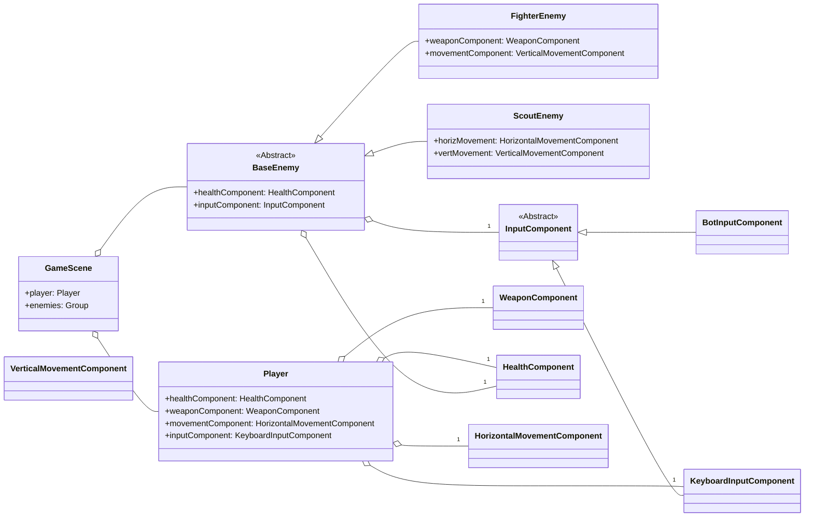

```mermaid
classDiagram
    direction LR

    class GameScene {
        +player: Player
        +enemies: Group
    }

    class Player {
        +healthComponent: HealthComponent
        +weaponComponent: WeaponComponent
        +movementComponent: HorizontalMovementComponent
        +inputComponent: KeyboardInputComponent
    }

    class BaseEnemy {
        <<Abstract>>
        +healthComponent: HealthComponent
        +inputComponent: InputComponent
    }

    class FighterEnemy {
        +weaponComponent: WeaponComponent
        +movementComponent: VerticalMovementComponent
    }

    class ScoutEnemy {
        +horizMovement: HorizontalMovementComponent
        +vertMovement: VerticalMovementComponent
    }

    class InputComponent {
        <<Abstract>>
    }
    class KeyboardInputComponent
    class BotInputComponent

    class WeaponComponent
    class HealthComponent
    class HorizontalMovementComponent
    class VerticalMovementComponent

    GameScene o-- Player
    GameScene o-- BaseEnemy

    Player o-- "1" HealthComponent
    Player o-- "1" WeaponComponent
    Player o-- "1" HorizontalMovementComponent
    Player o-- "1" KeyboardInputComponent

    BaseEnemy <|-- FighterEnemy
    BaseEnemy <|-- ScoutEnemy
    BaseEnemy o-- "1" HealthComponent
    BaseEnemy o-- "1" InputComponent

    InputComponent <|-- KeyboardInputComponent
    InputComponent <|-- BotInputComponent
```
